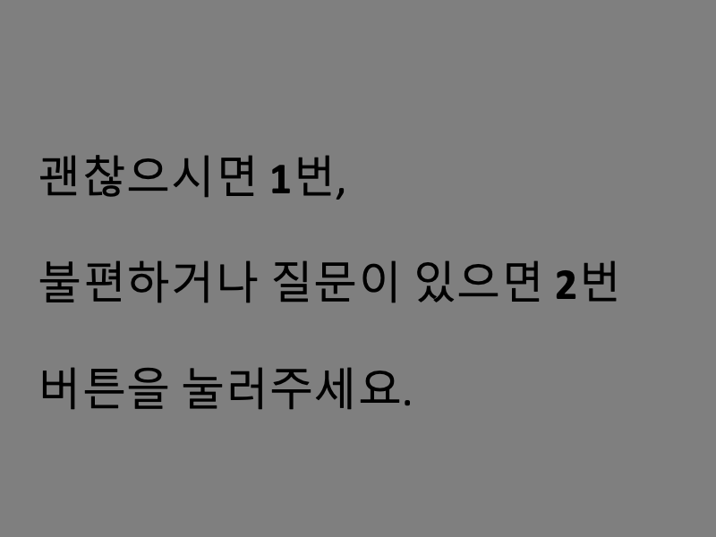

# 7T NatPAC Free Speech 실험 코드
## 실험 구성
세션에 따라 다른 실험을 진행한다. [NatPAC 세션 구성](https://docs.google.com/spreadsheets/d/15gjZwjmDhByIUrGN2RAGFYUj3_iIMwpp/edit#gid=299223931)\
아래의 task들이 있다.
- speechFREE: 10분 동안 아무 생각을 자유롭게 이야기.
- speechMOVIE: 이전에 본 영화를 자세히 회상.
- speechTOPICS: 세가지 주제에 대해 이야기.
    - 기억나는 화났거나 짜증났던 경험을 최대한 자세히 회상.
    - 사형 제도를 찬성하는가? 그 이유는?
    - 친구(들)을 최대한 자세히 묘사하기. (외형, 성격, 관계 등등)
- speechMC: 이전에 진행했던 마인크래프트 과제에 대해 자유롭게 이야기. 그 후 남는 시간 동안은 자유 주제 이야기.

 
 
 

## 실험 진행 및 결과
[`FreeSpeech_withcali.m`](./FreeSpeech_withcali.m)을 실행하면 실험의 처음부터 끝까지 진행 가능하다. 입력하는 세션 번호에 따라 알맞은 실험이 진행된다.
 
모든 종류의 실험은 아래 순서로 진행된다.

1. 피험자 분의 상태 확인 (speechMC에서는 생략)

MRI에서는 버튼 박스, 외에서는 키보드의 숫자키
2. 각 실험 instruction
3. Eyetracking calibration\
[Calibration 비디오](24points_calibration_40sec_1600x1000.mp4)
4. 본 실험\
    4.1. 시작 8초 fixation\
    4.2. 말하기 시작\
    4.3. 마무리 8초 fixation

녹음 결과는 `_AUDIO` 폴더 내에 bids format의 파일명으로 저장된다.\
Timestamp는 `_CSV` 폴더 내에 bids format의 파일명으로 저장된다.
