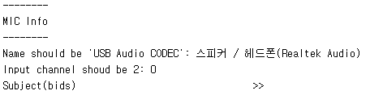

# 3T Free Speech 실험 코드
## 실험 구성
Free Speech는 다음과 같은 순서로 진행된다.  
1. Sound test
2. Resting
3. Speaking Task
4. Speaking Task
5. T1
6. Speaking Task
7. Listening Task
8. Listening Task

그리고 Speaking / Listening Task는 아래와 같은 종류가 있으며 순서는 랜덤이다.
<br/>

#### Speaking Task
- Think aloud: 10분 동안 주제 없이 자유롭게 말하기.
  
- Three topics: 아래 세 주제에 대해 최대 20분 동안 말하기.
  
    - 사형 제도를 찬성하는가? 그 이유는?
    - 친구(들)을 최대한 자세히 묘사하기 (외형, 성격, 인간관계 등등).
    - 기억나는 화가 났던 일에 대해 최대한 자세히 회상하기.
- Zig-zag: 두 주제를 왔다 갔다 하면서 이야기.
  
<br/>

#### Listening Task
- TA listening: Think aloud를 모사한 사전 녹음을 듣기
- 3 listening: Three topics을 모사한 사전 녹음을 듣기
<br/>
<br/>
<br/>

## 실험 진행 및 결과
[`TASK_all.m`](./TASK_all.m)을 실행하면 실험의 처음부터 끝까지 진행 가능하다. 알아서 Run순서를 무작위로 섞어준다.
<br/>
<br/>

**<주의>**\
스캐너에서 녹음이 되도록 하려면, 코드를 실행하자마자 출력되는 오디오 장치 정보와 연결된 오디오 장치 정보가 같아야 한다.

<br/>
(이 경우는 다른 것)

<br/>

결과는 `_DATA` 폴더 내에 피험자명으로 sub-XXX 폴더가 생성되어 그 안에 파일로 저장된다.\
각 Task마다
- `_timepoint.txt`: event 파일
- `XXX.wav`: 오디오 녹음 파일 (speech task에서만 생성)
- `_STT.txt`: 오디오 받아쓰기 파일 (speech task에서만 생성)

<br/>

Task 각각을 실행하려면,
- Sound test: [`soundtest.m`](./soundtest.m) 실행 (input 없음).
- Resting: [`resting.m`](./resting.m) 실행.
    ```Matlab
    resting(subName, listen)
    % subName: subject 이름 (결과 파일에 반영됨)
    % listen: 1이면 scanner, 2이면 외부
    ```
- Speaking task: [`speech.m`](./speech.m) 실행.
    ```Matlab
    speech(subName, runName, listen)
    % subName: subject 이름 (결과 파일에 반영됨)
    % runName
    %     - "1": think aloud
    %     - "2": three topics
    %     - "3": zig-zag
    % listen: 1이면 scanner, 2이면 외부
    ```
- Listening task: [`listening.m`](./listening.m) 실행.
    ```Matlab
    speech(subName, runName, listen)
    % subName: subject 이름 (결과 파일에 반영됨)
    % runName
    %     - "1": TA listening
    %     - "2": 3 listening
    % listen: 1이면 scanner, 2이면 외부
    ```