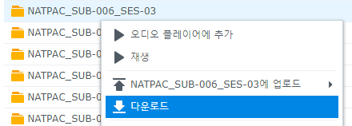
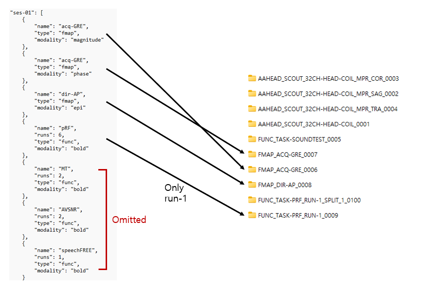
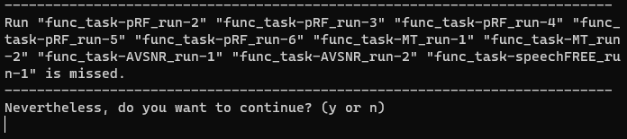
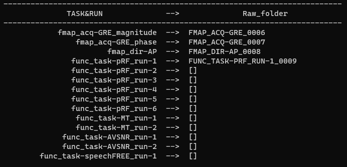
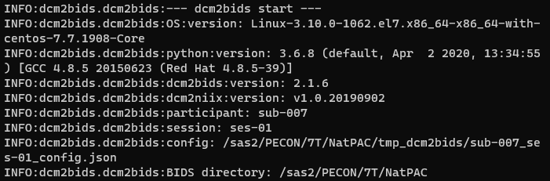

# NatPAC dcm2bids
CNIR 서버에서 NatPAC 데이터 bids서식화 
<br/>
<br/>
<br/>

## 0. 파일 설명 (`./dcm2bids`)
- [`project_info.json`](./dcm2bids/project_info.json): NatPAC session information (for code)
- [`run_dcm2bids.py`](./dcm2bids/run_dcm2bids.py): 메인 코드
- [`run_dcm2bids.sh`](./dcm2bids/run_dcm2bids.sh): 위 코드를 bash로 실행하는 코드
- [`run_dcm2bids_forserver.py`](./dcm2bids/run_dcm2bids_forserver.py): 서버용 코드 (한글 주석 없음)
<br/> 
<br/>
<br/>

## 1. 서버에 파일 업로드
CNIR05에서 피험자 폴더 자체를 다운받는다.



<br/>

압축을 풀지 않고, 바로 서버로 업로드한다. ([`run_dcm2bids.sh`](./dcm2bids/run_dcm2bids.sh)의 파일 업로드 단락 참고)
```bash
### 변수
sub=003
ses=07
download_path=/mnt/c/Users/Kwon/Downloads

### 서버에 파일 업로드
# 로컬 *.zip파일을 /sas2/PECON/7T/NatPAC/sourcedata로
# 로컬에서 실행
scp ${download_path}/NATPAC_SUB-{sub}_SES-{ses}.zip  wonmokshim@115.145.185.185:/sas2/PECON/7T/NatPAC/sourcedata/
```
<br/>
<br/>
<br/>

## 2. dcm2bids 실행
서버에 접속해서 [`run_dcm2bids.sh`](./dcm2bids/run_dcm2bids.sh)의 코드를 실행한다.
```bash
### 변수, 여기만 수정
sub=008
ses=pre02         # XXR, XXa... 도 가능

### dcm2bids 실행
python3 /sas2/PECON/7T/NatPAC/code/dcm2bids/run_dcm2bids.py ${sub} ${ses}
```

다음과 같은 순서로 코드가 실행된다.
1. 압축 해제, 압축 파일이 없을 경우 스킵하고 타깃하는 IMA 폴더를 찾는다.
2. IMA 폴더와 프로토콜 매칭 (23/03/22 이후의 스캔만 가능.)
    - 한 sub-session에 여러 스캔을 했다면 (`HEAD_HCP*` 폴더가 여러개) 가장 최근에 한 것만 처리된다.
    - [`JSON`](./dcm2bids/project_info.json)에 저장되어 있는 run 정보에 해당하는 폴더를 하나만 매칭한다.\
     (같은 이름을 반복해서 찍은 경우 가장 최근에 찍은 것만 지정된다.)\
    
    - 정보는 있지만 run을 시행하지 않은 경우 경고문이 뜬다.\
    
    - 마지막으로 매칭 결과를 출력한다.\
    
3. `bids_path/tmp_dcm2bids`에 config 파일 생성 ([예시](./sub-007_ses-01_config.json))
4. `dcm2bids` 실행


    

<br/>
<br/>
<br/>

## 3. Customize
1. **Custom config file**\
   직접 dcm2bids에 적용하기 위한 config file을 만들었다면 [`run_dcm2bids.py`](./dcm2bids/run_dcm2bids.py)의 `--custom_config` 옵션
   ```bash
    ### 변수
    sub=008
    ses=pre02         
    config_path=/your/config/path 

    ### dcm2bids 실행
    python3 /sas2/PECON/7T/NatPAC/code/dcm2bids/run_dcm2bids.py ${sub} ${ses} --custom_config ${config_path}
    ```

2. **Custom input path**\
    다른 IMA 폴더 위치를 쓰고 싶다면 [`run_dcm2bids.py`](./dcm2bids/run_dcm2bids.py)의 `--input_path` 옵션
   ```bash
    ### 변수
    sub=008
    ses=pre02         
    input_path=/your/IMA/path 

    ### dcm2bids 실행
    python3 /sas2/PECON/7T/NatPAC/code/dcm2bids/run_dcm2bids.py ${sub} ${ses} --input_path ${input_path}
    ```    
3. **Do it at local**\
   [`dcm2bids`](./dcm2bids)폴더를 다운받고 아래 과정을 따라한다.
   1. [`project_info.json`](./dcm2bids/project_info.json)의 `bids_path`를 local bids path로
        ```json
        {
            "Name": "NatPAC",
            "bids_path": "/sas2/PECON/7T/NatPAC",    # change to your local bids path
            "ses-pre02": [
            ...
        ```       
   2. [`run_dcm2bids.py`](./dcm2bids/run_dcm2bids.py)의 default parameters를 수정 
        ```python
        ## NatPAC session 정보를 불러오기 
        def load_info(ses, filepath="/path/of/project_info.json"):  # filepath를 project_info.json 경로로
            ...

        ## Raw 파일 확인하기
        def check_dcm(sub, ses, raw_path="/path/of/IMA/download"):  # raw_path를 다운로드 폴더로
            ...
        ``` 
    3. `run_dcm2bids.py` 실행
        ```bash
        ### 변수
        sub=008
        ses=pre02        
        script_path=/your/run_dcm2bids.py/path    # run_dcm2bids.py를 저장한 path

        ### dcm2bids 실행, --custom_config, --input_path 옵션 역시 사용 가능
        python3 /sas2/PECON/7T/NatPAC/code/dcm2bids/run_dcm2bids.py ${sub} ${ses}
        ```
