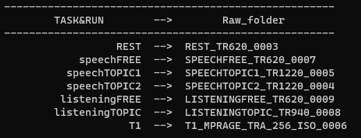
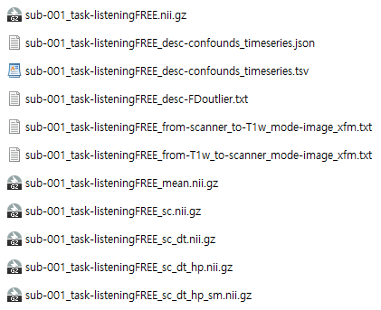
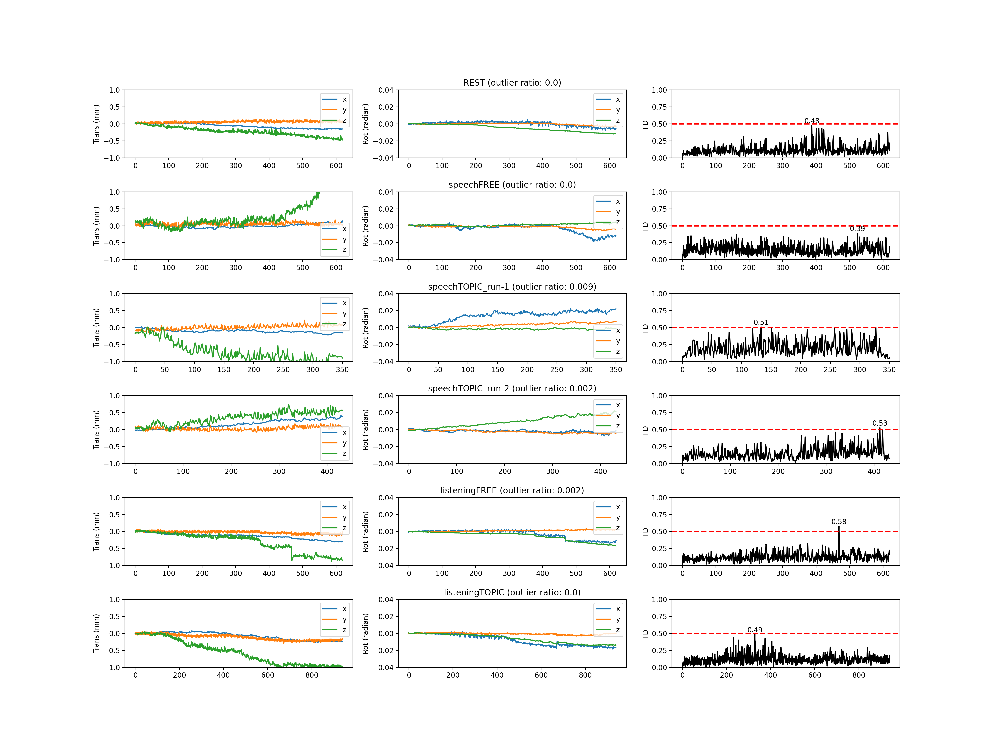

# fMRI Preprocessing
[다음](https://n-kwon.notion.site/20221004-780d16024f3149ae91cdca3376a8ee63) session을 preprocessing 해보자. (TR=1s, 3×3×3mm^3^)
\
\
\
\
## 1. bids format 생성
먼저 CNIR 서버에서 다음 파일을 다운로드 하고 압축을 푼다.
`3TMRIdata/2022_10/HK_SPEECH_20221004KHY`\
\
`preprocessing_allinone.sh`의 dcm2bids 단락의 `input` 변수를 수정하자.
그리고 이 Free-Speech 폴더 위치에서 해당 단락을 실행.

```bash
input=압축 푼 폴더 경로
project=speech_3T
sub=001
script_path=Speech/Preprocessing

python ${script_path}/dcm2bids_all.py ${project} ${input} ${sub}
```

그러면 아래와 같이 bids format의 run이름 --> Raw 폴더의 매칭 결과를 출력하고 bids format을 만든다.

\
\
## 2. fMRIprep
[fMRIprep 도커](https://fmriprep.org/en/stable/installation.html)를 설치한 뒤,\
`preprocessing_allinone.sh`의 fMRIprep 단락을 Free-Speech 폴더 위치에서 실행

```bash
subs="001"
bids_path=speech_3T/_DATA_fMRI

for sub in $subs
do
fmriprep-docker ${bids_path} ${bids_path}/derivatives participant --participant-label ${sub}  --n_cpus 20 --fs-license-file ~/freesurfer/license.txt --skip_bids_validation
done
```

실행이 되지 않을 경우 `fmriprep-docker` 실행 변수를 자신의 컴퓨터 환경에 맞게 수정하자.
다음 단계로 넘어가기 전에 `speech_3T/_DATA_fMRI/derivatives/sub-001.html`을 보고 prep이 잘 되었나 확인하자.
\
\
## 3. 후처리
나머지 후처리를 진행한다. [AFNI](https://afni.nimh.nih.gov/)가 필요하다.
* Save motion plot & Updata good subject list
* Denosing (global signal, FD, 6 motion, 6 motion derivatives, 6 aCompCor)
* Scaling (mean=0)
* Detrending 
* Frequency filtering (bandpass: 0.01 ~ 99999 (Hz))
* Smoothing (2→3, 2.5→4, 3→5 (mm))
`preprocessing_allinone.sh`의 preprocess 단락을 Free-Speech 폴더 위치에서 실행

```bash
subs="001"
project=speech_3T
script_path=Speech/Preprocessing

for sub in $subs
do
python ${script_path}/afterprep_all.py ${project} ${sub}
done
```

실행 결과 아래와 같은 파일들이 생성


모션 이미지는 `speech_3T/_DATA_fMRI/derivatives/sub-001/figures/sub-001_motion.png`로 저장된다.

\
\
## 내 데이터에 적용해보기
내 환경에 맞추어 `Speech/_data_Project/`의 프로젝트 정보를 생성하면 된다.\
`Speech/make_project_info.py`를 통해 프로젝트 정보를 만들거나, 직접 프로젝트 폴더를 생성해서 `project_info.json`을 만들면 된다.
