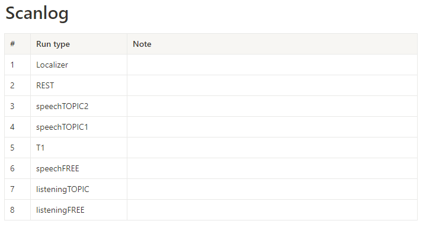
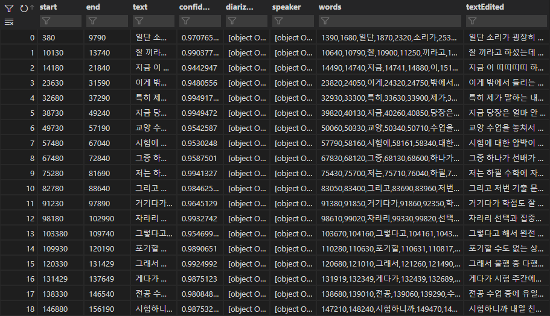
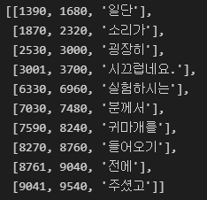
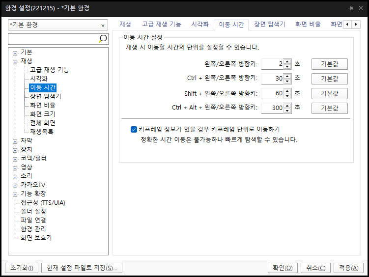

# fMRI Preprocessing
(코드는 [`/Free-Speech/Speech/Preprocessing/EPI.py`](../Speech/Preprocessing/EPI.py) 참고)\
[다음](https://n-kwon.notion.site/20221004-780d16024f3149ae91cdca3376a8ee63) session을 preprocessing 해보자. (TR=1s, 3×3×3mm<sup>3</sup>)
<br/>


<br/>
<br/>
<br/>

## 1. bids format 생성
먼저 CNIR 서버에서 다음 파일을 다운로드 하고 압축을 푼다.
[`3TMRIdata/2022_10/HK_SPEECH_20221004KHY`]\
[`preprocessing_allinone.sh`](./preprocessing_allinone.sh)의 dcm2bids 단락의 `input` 변수를 수정하자.
그리고 이 Free-Speech repository 폴더 위치에서 해당 단락을 실행.

```bash
input=압축 푼 폴더 경로
project=speech_3T
sub=001
script_path=Speech/Preprocessing

python ${script_path}/dcm2bids_all.py ${project} ${input} ${sub}
```

그러면 아래와 같이 bids format의 run이름 --> Raw 폴더의 매칭 결과를 출력하고 bids format을 만든다.

<br/>
<br/>
<br/>

## 2. fMRIprep
[fMRIprep 도커](https://fmriprep.org/en/stable/installation.html)를 설치한 뒤,\
[`preprocessing_allinone.sh`](./preprocessing_allinone.sh)의 fMRIprep 단락을 Free-Speech repository 폴더 위치에서 실행

```bash
subs="001"
bids_path=speech_3T/_DATA_fMRI

for sub in $subs
do
fmriprep-docker ${bids_path} ${bids_path}/derivatives participant --participant-label ${sub}  --n_cpus 20 --fs-license-file ~/freesurfer/license.txt --skip_bids_validation
done
```

실행이 되지 않을 경우 `fmriprep-docker` 실행 변수를 자신의 컴퓨터 환경에 맞게 수정하자.
다음 단계로 넘어가기 전에 `speech_3T/_DATA_fMRI/derivatives/sub-001.html`을 보고 prep이 잘 되었나 확인하자.
<br/>
<br/>
<br/>

## 3. 후처리
나머지 후처리를 진행한다. [AFNI](https://afni.nimh.nih.gov/)가 필요하다.
* Save motion plot & Updata good subject list
* Denosing (global signal, FD, 6 motion, 6 motion derivatives, 6 aCompCor)
* Scaling (mean=0)
* Detrending 
* Frequency filtering (bandpass: 0.01 ~ 99999 (Hz))
* Smoothing (2→3, 2.5→4, 3→5 (mm))\
[`preprocessing_allinone.sh`](./preprocessing_allinone.sh)의 preprocess 단락을 Free-Speech repository 폴더 위치에서 실행

```bash
subs="001"
project=speech_3T
script_path=Speech/Preprocessing

for sub in $subs
do
python ${script_path}/afterprep_all.py ${project} ${sub}
done
```

실행 결과 아래와 같은 파일들이 생성  

<br/>

모션 이미지는 `speech_3T/_DATA_fMRI/derivatives/sub-001/figures/sub-001_motion.png`로 저장된다.

<br/>
<br/>
<br/>

## 내 데이터에 적용해보기
내 환경에 맞추어 `/Free-Speech/Speech/_data_Project/`에 프로젝트 정보를 생성하면 된다.\
[`Speech/make_project_info.py`](../Speech/make_project_info.py)를 통해 프로젝트 정보를 만들거나, 직접 프로젝트 폴더를 생성해서 `project_info.json`을 만들면 된다.


```python
# %%
import numpy as np
import os
import json

# 정보 파일 저장 위치: Speech/_data_Project/Project_Name/에 저장
base_path = "D:/Functions/Speech/_data_Project"
#base_path = "/mnt/d/Functions/Speech/_data_Project"


#####################################################################################
# 프로젝트 이름 
Project_name = "Speech_3T"
os.makedirs(os.path.join(base_path,Project_name), exist_ok=True)
# bids path
bids_path = "/mnt/d/speech_3T/_DATA_fMRI"
# for WSL environment, ubuntu면 빈 문자열으로
bids_path_window = "D:/speech_3T/_DATA_fMRI" 
# session이 존재하면 그 개수를, 아니면 0
sessions = 0

audio_path = "/mnt/d/speech_3T/_DATA_Audio"
audio_path_window = "D:/speech_3T/_DATA_Audio"


#####################################################################################
# run 정보, 세션이 여러개라면 이중 리스트를 만들어야 한다. 하나면 단일 리스트 (ex: [[ses1],[se2]])
# task 이름은 bids format에서 task-XXX로 붙는 이름이다.
# fMRI protocol 이름은 위 task이름이 기준이다. task-speech_run-1(task name) --> SPEECH1(protocol name) 
# 위의 조건에 맞지 않을 경우 실행 안되므로 protocol이름을 수정하거나 아니면 코드를 수정한다.
run_name = ["REST", "speechFREE", "speechTOPIC", "listeningFREE", "listeningTOPIC", "T1"] # T1도 포함해야.

# 각 task마다 최대 run수 (T1포함-> T1은 0으로), bids의 run-XX이 안나오게 하길 원한다면 0으로,
# run-1이 무조건 붙어 있게 하고프면 1으로 하면 된다.
# session마다 만들어야 하며, 역시 여러 세션이면 이중 리스트, 아니면 단일 리스트로
run_numbers = [0,0,2,0,0,0]


#####################################################################################
# 여기부턴 바꾸지 않는다.
# json 생성
if sessions == 0:
    info = []
    for i in range(len(run_name)):
        run_data = {}
        run_data['name'] = run_name[i]
        if run_numbers[i]: run_data['runs'] = run_numbers[i]
        # try:
        #     if run_type[i]: run_data['type'] = run_type[i]
        # except: pass
        info.append(run_data)

    project_data = {
        'Name': Project_name,
        'bids_path': bids_path,
        'bids_path_window': bids_path_window,
        'audio_path': audio_path,
        'audio_path_window': audio_path_window,
        'info': info
    }

else: 
    project_data = {
        'Name': Project_name,
        'bids_path': bids_path,
        'bids_path_window': bids_path_window
    }

    for ses in range(sessions):
        info = []
        for i in range(len(run_name[ses])):
            run_data = {}
            run_data['name'] = run_name[ses][i]
            if run_numbers[ses][i]: run_data['runs'] = run_numbers[ses][i]
            # try:
            #     if run_type[ses][i]: run_data['type'] = run_type[ses][i]
            # except: pass
            info.append(run_data)
            
        project_data["ses-"+str(ses+1)] = info
        

# 저장
json_path = os.path.join(base_path, Project_name, "project_info.json")
with open(json_path, "w", encoding="utf-8") as f:
    json.dump(project_data, f, indent=4)

```
<br/>
<br/>
<br/>
<br/>
<br/>

# Audio Preprocessing
(코드는 [`/Free-Speech/Speech/Preprocessing/Audio.py`](../Speech/Preprocessing/Audio.py) 참고)\
Raw audio → word timestamp 까지
<br/>
<br/>
<br/>

## 1. 자동 받아쓰기 및 강제 정렬
[네이버 클로바](https://clova.ai/speech)를 이용하여 받아쓰기 및 강제 정렬(단어의 시작 및 끝 시간 추출)을 진행한다.\
[네이버 클라우드 플랫폼 및 클로바 사용법](https://n-kwon.notion.site/Naver-Clova-84f61011a0d54b9c916c39878d22818d)

```python
import requests
import json
import glob
import numpy as np
import os

files = 'audio_file_path'
invoke_url = 'https://clovaspeech-gw.ncloud.com/external/v1/2227/2752bda02f64f65c39aef44ddfe935dd3a6a7c9c061e687484f67707ee3f975c'
secret = 'your_secret_key'          
request_body = {
    'language': 'ko-KR',
    'completion': 'sync',
    'callback': None,
    'userdata': None,
    'wordAlignment': True,
    'fullText': True,
    'forbiddens': None,
    'boostings': None,
    'diarization': None,
}
headers = {
    'Accept': 'application/json;UTF-8',
    'X-CLOVASPEECH-API-KEY': secret
}
files = {
    'media': open(file_path, 'rb'),
    'params': (None, json.dumps(request_body, ensure_ascii=False).encode('UTF-8'), 'application/json')
}
response = requests.post(headers=headers, url=invoke_url + '/recognizer/upload', files=files)

# 클로바 요청
results = response.text
```
<br/>


`results`는 json형식으로 저장된다. (자세한 내용은 [여기](https://api-fin.ncloud-docs.com/docs/ai-application-service-clovaspeech-clovaspeech) 참고)
```python3
# json 결과 불러오기 -> 딕셔너리 형식
results = json.loads(results)
# 받아쓰기 결과는 문장 단위(클로바가 알아서 나눔)로 저장된다.
sentences = results['segments']
```


문장별 받아쓰기가 아니라 단어별 받아쓰기가 필요함으로 이 중 `words`만 따로 뽑아서 저장하면 된다.
<br/>
<br/>

\
`words` 안에는 [시작 시각(ms), 끝 시각(ms), 단어]의 리스트가 저장되어 있다.
<br/>
<br/>

```python
# 전체 받아쓰기 결과
full_text = results['text'] 
# 단어별 결과
FA = sentences[0]['words']
for i in range(1,len(sentences)):
    FA = FA + sentences[i]['words']
# 결과 저장하기
f_stt = open(file_path.split(".")[0]+"_STT.txt", 'w', encoding="utf-8")
f_stt.write(full_text)
f_stt.close()
f_FA = open(file_path.split(".")[0]+"_FA.txt", 'w', encoding="utf-8")
for i in range(len(FA)):
    f_FA.write('{0:<8}{1:<8}{2}\n'.format(FA[i][0], str(FA[i][1]), str(FA[i][2])))
f_FA.close()
```

이를 한번에 하고자 한다면 [`/Free-Speech/Speech/Preprocessing/Audio.py`](../Speech/Preprocessing/Audio.py)의 `Clova_STT(file_path)` function을 이용하면 된다.
<br/>
<br/>
<br/>

### 2. 받아쓰기 수정
받아쓰기 결과는 직접 수정해야 한다. 결과 파일 중 `_FA.txt`의 받아쓰기 및 시간을 수정한다.\
그리고 그 결과 파일은 같은 경로에 `_FA_new.txt`로 저장한다.\
<br/>

**수정 시 유의사항**
* 문장의 끝을 온점으로 구분하기 때문에 온점을 꼭 추가해주자. 반대로 이상한 곳에 찍혀있는 온점은 없애자.
* 시간을 수정할 때는 1ms정도는 몰라도, TR단위는 정확하게 하려고 노력하자.
* 말 더듬은 것, 음... 어... 같은 단어들은 받아쓰기가 안 되어 있을 가능성이 크다. 의도에 맞게 수정한다.
<br/>

**내가 만약 윈도우 사용자라면...**\
[팟플레이어](https://tv.kakao.com/guide/potplayer) 사용을 추천.\
팟플레이어는 방향키로 재생 시간을 이동할 수 있는데, 이 시간을 조절할 수 있어서 매우 편하다.\
\

<br/>
<br/>
<br/>

### 3. `_FA_new.txt`로부터 나머지 정보 추출하기

##### 3.1 `_STT.txt` 수정 
```python
def apply_FA(file_path):
    """ _FA_new.txt 파일을 통해 _STT_new.txt를 생성
    
        Args: 
            file_path (str): _FA_new.txt 파일 경로
    """
    STT_new = []
    f_FA_new = open(file_path, 'r', encoding="utf-8")
    FA_new_lines = f_FA_new.readlines()
    for line in FA_new_lines:
        if line:
            word = line.split()[-1]
            STT_new.append(word)

    STT_new = " ".join(STT_new).split(". ")
    f_stt_new = open(file_path[:-11]+"_STT_new.txt", 'w', encoding="utf-8")
    for i in range(len(STT_new)):
        if i == len(STT_new)-1:
            f_stt_new.write(STT_new[i])
        else:
            f_stt_new.write(STT_new[i]+".\n")
    f_stt_new.close()
    return "Finished"
```
<br/>

##### 3.2 문장 종결 지점, 말 한 시간 추출
```python
def audiostamp(input, output_folder="./"):
    """ FA_new.txt를 통해 문장의 종결 지점 & 말 한 지점 & topic boundary를 추가해야 할 더미 파일 저장
    Args:
        input (str): *_FA_new.txt
        output_folder (str, optional): 결과 파일 위치. Defaults to "./".
    """
    with open(input, 'r', encoding="utf-8") as f:
        text = f.readlines()
    # speech time
    timestamp = []
    for line in text:
        line = line.split()
        timestamp.append(line[:2])
    timestamp = np.array(timestamp, dtype=int)
    # sentence
    sentence = []
    for line in text:
        if line.strip()[-1] == ".":
            sentence.append(line.split()[1])
    # save
    # speech & silence
    filename = input.split("_FA_new.txt")[0]
    filename = os.path.basename(filename)
    with open(os.path.join(output_folder, filename+"_speech.txt"), 'w', encoding="utf-8") as f:
        for i in range(len(timestamp)):
            f.write(str(timestamp[i,0])+":"+str((timestamp[i,1]-timestamp[i,0]))+'\t')
    with open(os.path.join(output_folder, filename+"_silence.txt"), 'w', encoding="utf-8") as f:
        for i in range(len(timestamp)-1):
            f.write(str(timestamp[i,1])+":"+str((timestamp[i+1,0]-timestamp[i,1]))+'\t')
    # save
    # sentence
    with open(os.path.join(output_folder, filename+"_sentence.txt"), 'w', encoding="utf-8") as f:
        for time in sentence:
            f.write(time)
            if not time == sentence[-1]: f.write("\n")
    # save
    # dummy: topic
    with open(os.path.join(output_folder, filename+"_event.txt"), 'w', encoding="utf-8") as f:
        f.write("[1]\n\n[2]\n")
```

<br/>
<br/>
<br/>

### All in one
오디오 전처리를 한 번에 하고자 한다면, [`/Free-Speech/speech_3T/audio_preprocessing_allinone.py`](audio_preprocessing_allinone.py)를 실행\
예시 파일이 있으니 Free-Speech repository 폴더 위치에서 실행하면 전처리를 체험해볼 수 있다.\
내 파일에 맞게 커스텀을 하려면 변수만 수정하면 된다. 단, 오디오 파일명도 bids format을 따라야 한다.

```python
# %%
from Speech.Preprocessing import Audio
from Speech.tools import isWSL
import os
import shutil

audio_path = "speech_3T/_data_Audio"

tasks = ["speechFREE"] # 과제명
subs = "001"  # 피험자, 띄어쓰기 구분
subs = subs.split()

for sub in subs:
    outpath = os.path.join(audio_path, "derivatives", "sub-"+sub)
    try: os.mkdir(outpath)
    except: pass
    for task in tasks:
        filename = "sub-"+sub+"_task-"+task+".wav"
        audio = os.path.join(audio_path, "sub-"+sub, filename)
        Audio.Clova_STT(audio)
        
        input(filename[:-4]+"_FA.txt를 수정한 뒤, '_FA_new.txt' 라는 이름으로 저장한다. 끝났으면 엔터.")
        
        filename = "sub-"+sub+"_task-"+task+"_FA_new.txt"
        Audio.apply_FA(os.path.join(audio_path, "sub-"+sub, filename))
        
        Audio.audiostamp(os.path.join(audio_path, "sub-"+sub, filename), outpath)
        
        # copy
        shutil.copy(os.path.join(audio_path, "sub-"+sub, filename), 
                    os.path.join(outpath, filename))
        filename = "sub-"+sub+"_task-"+task+"_STT_new.txt"
        shutil.copy(os.path.join(audio_path, "sub-"+sub, filename), 
                    os.path.join(outpath, filename))
```
